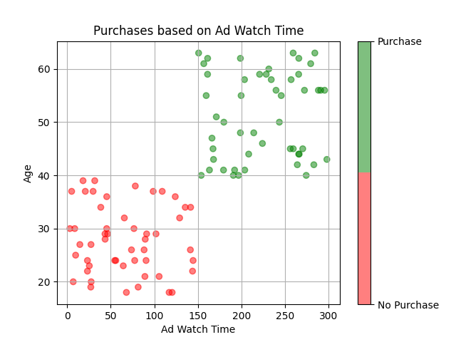
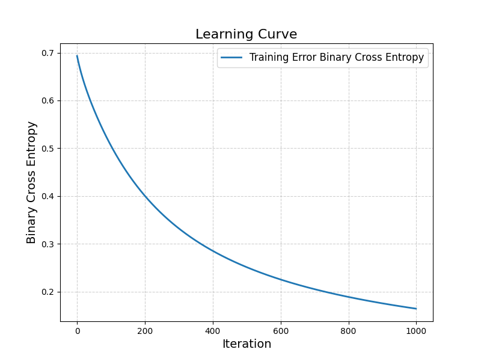
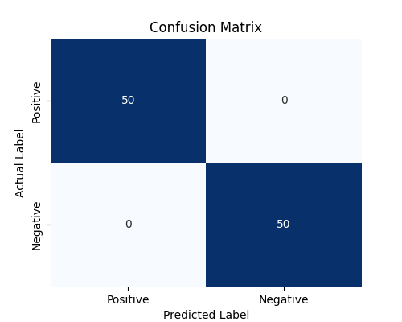
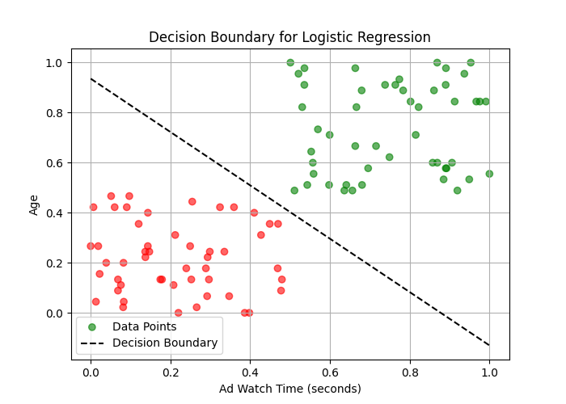

# Logistic Regression

## Introduction
This project implements **Logistic Regression** from scratch using **NumPy**, without relying on **sklearn**. The implementation includes:
- **Vectorized** gradient descent for efficient optimization.
- **Min-Max scaling** for feature normalization.
- **Binary Cross Entropy loss** for convergence tracking.
- **Evaluation metrics** like **Confusion Matrix, Precision, Recall, and F1-score**.

### Dataset (Generated Sample)
The dataset used for training is a **generated sample** and contains two input features:
1. **Ad Watch Time (seconds)**
2. **Age**

The target variable (**Purchase**) is a binary class indicating whether a user made a purchase (1) or not (0).

A scatter plot of the dataset is shown below:



---

## Project Structure

This project consists of the following Python files:

- **main.py**: Loads data, trains the logistic regression model, and generates visualizations.
- **regressor.py**: Implements the Logistic Regression model with gradient descent.
- **utils.py**: Contains helper functions for scaling, plotting, and evaluation metrics.

---

## Implementation

### 1. **Data Preprocessing**
- Load dataset (`data.csv`)
- Apply **Min-Max Scaling**:
    - ```X_scaled = (X - min(X)) / (max(X) - min(X))```

### 2. **Logistic Regression Model**
- Initialize weights and bias to zero:
    - ``` w = [0,0], b = 0 ```
- Compute **sigmoid function**:
    - ``` sigmoid(z) = 1/(1 + e^(-z)) ```
- Compute **Binary Cross Entropy Loss**:
    - ``` -1 * mean(y * log(y_pred) + (1 - y) * log(1 - y_pred)) ```
- Compute **Gradients**:
    - ``` dw = (X^T . errors) / n_samples ```
    - ``` db = sum(errors) / n_samples ```
- Update weights:
    - ``` w = w - (alpha * dw) ```
    - ``` b = b - (alpha * db) ```

### 3. **Training**
- Run **gradient descent** for multiple iterations until convergence.
- Record loss at each iteration and plot the **learning curve**:



### 4. **Prediction & Evaluation**
- Use the trained model to predict class labels.
- Evaluate model performance using:
  - **Confusion Matrix**:

    

  - **Decision Boundary Visualization**:

    

---

## Conclusion
This project successfully demonstrates the implementation of **Logistic Regression from scratch**. It provides insights into:
- **Mathematical formulation** of logistic regression.
- **Vectorized gradient descent** for optimization.
- **Performance evaluation** using various metrics.
